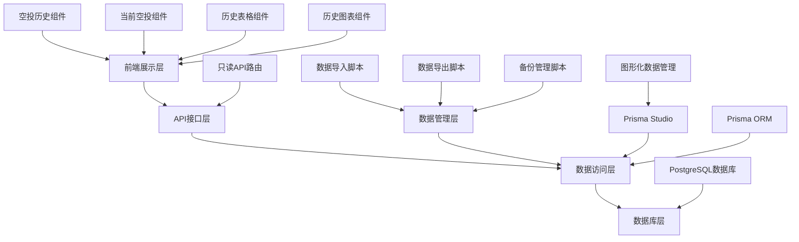

# 空投数据管理功能 - 设计文档

## 概述

本设计文档描述了基于Prisma Studio的空投数据管理系统的技术架构和实现方案。系统采用数据库优先的设计理念，通过Prisma Studio进行数据管理，前端提供只读展示界面，并配备统一的数据导入/导出脚本。

## 架构设计

### 系统架构图



### 技术栈

- **前端框架**: Next.js 14 + React 18
- **UI组件库**: Radix UI + Tailwind CSS
- **数据可视化**: Recharts
- **数据库**: PostgreSQL (Supabase)
- **ORM**: Prisma
- **数据管理**: Prisma Studio
- **类型安全**: TypeScript
- **脚本工具**: Node.js + TypeScript

## 组件设计

### 1. 核心组件结构

```
components/airdrop/
├── airdrop-history.tsx             # 主容器组件
├── current-airdrops.tsx           # 当前空投展示组件
├── history-table.tsx              # 历史数据表格组件
└── history-chart.tsx              # 历史数据图表组件
```

### 2. AirdropHistory 组件

**职责**: 作为主容器组件，协调数据加载和视图切换

```typescript
interface AirdropHistoryProps {
  // 无需props，直接从API加载数据
}

interface AirdropHistoryState {
  activeView: "chart" | "table"
  allData: AirdropItem[]
  loading: boolean
  error: string | null
}
```

**主要功能**:
- 从API加载空投数据
- 分离当前空投和历史数据
- 管理视图切换状态
- 计算历史数据的收益信息

### 3. CurrentAirdrops 组件

**职责**: 展示当前进行中的空投信息和实时倒计时

```typescript
interface CurrentAirdropsProps {
  currentAirdrops: CurrentAirdropItem[]
}

interface AirdropStatusInfo {
  status: string
  color: "gray" | "red" | "blue" | "orange"
  progress: number
  phase: "waiting" | "phase1" | "phase2" | "single" | "ended"
  currentPhase: string | null
  points: number
}
```

**主要功能**:
- 实时倒计时计算
- 两阶段空投进度展示
- 状态颜色和进度条管理
- 响应式布局适配

### 4. HistoryTable 组件

**职责**: 以表格形式展示历史空投数据

```typescript
interface HistoryTableProps {
  airdropHistoryData: AirdropHistoryItem[]
}
```

**主要功能**:
- 表格数据展示
- 两阶段积分门槛显示
- 免费领取标识
- 收益计算展示

### 5. HistoryChart 组件

**职责**: 以图表形式展示历史趋势

```typescript
interface HistoryChartProps {
  airdropHistoryData: AirdropHistoryItem[]
  averagePoints: number
  averageRevenue: string
}
```

**主要功能**:
- 积分门槛趋势图
- 收益趋势图
- 平均线显示
- 数据点交互

## 数据模型设计

### 数据库模型 (已存在)

```prisma
model Airdrop {
  id                  Int      @id @default(autoincrement())
  date                String
  token               String   @unique // 添加唯一约束
  points              Int
  participants        Int?
  amount              Float
  supplementaryToken  Float
  currentPrice        String?
  type                AirdropType
  cost                Float?
  pointsConsumed      Boolean  @default(true)
  
  startTime           String?
  endTime             String?
  
  phase1Points        Int?
  phase2Points        Int?
  phase1EndTime       String?
  phase2EndTime       String?
  
  description         String?
  
  createdAt           DateTime @default(now())
  updatedAt           DateTime @updatedAt
  
  @@map("airdrops")
}
```

### TypeScript 类型定义

```typescript
// 扩展现有的 AirdropItem 类型
export interface AirdropFormData extends Omit<AirdropItem, 'id' | 'createdAt' | 'updatedAt'> {
  // 表单特定的字段
}

export interface AirdropEditState {
  mode: 'create' | 'edit'
  isTokenChecking: boolean
  existingData: AirdropItem | null
}

export interface AirdropValidationError {
  field: string
  message: string
}
```

## API 设计

### 1. 只读空投数据API

```typescript
// GET /api/airdrop
export interface GetAirdropsResponse {
  success: boolean
  data: AirdropItem[]
  error?: string
}
```

### 2. API 路由实现

```typescript
// app/api/airdrop/route.ts
export async function GET(request: NextRequest) {
  try {
    // 获取所有空投数据
    const airdrops = await prisma.airdrop.findMany({
      orderBy: {
        createdAt: 'desc'
      }
    })

    return NextResponse.json({
      success: true,
      data: airdrops
    })
  } catch (error) {
    console.error('获取空投数据失败:', error)
    return NextResponse.json(
      {
        success: false,
        error: '获取空投数据失败'
      },
      { status: 500 }
    )
  } finally {
    await prisma.$disconnect()
  }
}
```

### 3. 数据管理脚本API

系统通过命令行脚本进行数据管理，而非Web API：

```typescript
// scripts/data-manager.ts
// 支持的命令：
// - pnpm db:import       # 从最新备份文件导入数据到数据库
// - pnpm db:export       # 从数据库导出数据到备份文件  
// - pnpm db:list-backups # 列出所有可用的备份文件
```

## 状态管理设计

### React 内置状态管理

系统使用React的内置状态管理（useState, useEffect, useMemo）来管理组件状态：

```typescript
// AirdropHistory 组件状态
interface AirdropHistoryState {
  activeView: "chart" | "table"
  allData: AirdropItem[]
  loading: boolean
  error: string | null
}

// CurrentAirdrops 组件状态
interface CurrentAirdropsState {
  countdowns: { [key: string]: AirdropStatusInfo }
}

// 数据加载和处理逻辑
const loadAirdropData = useCallback(async () => {
  try {
    setLoading(true)
    setError(null)
    const response = await fetch('/api/airdrop')
    const result = await response.json()
    if (result.success && result.data) {
      setAllData(result.data)
    } else {
      setError(result.error || '加载空投数据失败')
    }
  } catch (err) {
    setError('网络错误，无法加载空投数据')
  } finally {
    setLoading(false)
  }
}, [])
```

## 用户界面设计

### 1. 主界面布局

```
┌─────────────────────────────────────────────────────────┐
│ 空投领取提醒 (当前空投卡片)                               │
├─────────────────────────────────────────────────────────┤
│ TOKEN | Alpha | 优先获取阶段 | 倒计时: 2天3小时          │
│ 积分门槛: 200/400分 | 数量: 24000 | 进度条: ████▓▓▓▓    │
└─────────────────────────────────────────────────────────┘

┌─────────────────────────────────────────────────────────┐
│ 空投历史数据                                              │
├─────────────────────────────────────────────────────────┤
│ [📊 数据表格] [📈 历史曲线]                              │
├─────────────────────────────────────────────────────────┤
│ 日期      │ 代币  │ 积分门槛│ 数量  │ 价格   │ 收益  │类型│
├─────────────────────────────────────────────────────────┤
│ 2025年08月│ MM   │ 200分   │ 24000 │ $0.001 │ $24.0 │Alpha│
│ 2025年08月│ AIO  │ 200分   │ 750   │ $0.045 │ $33.8 │Alpha│
│ ...       │ ...  │ ...     │ ...   │ ...    │ ...   │... │
└─────────────────────────────────────────────────────────┘
```

### 2. 当前空投卡片设计

```
┌─────────────────────────────────────────────────────────┐
│ 🕐 空投领取提醒                           [实时倒计时]    │
├─────────────────────────────────────────────────────────┤
│ TOKEN (ALPHA) [优先获取阶段]                             │
│ 🎁 免费领取 (如果适用)                                   │
│                                                         │
│ 空投数量: 24,000 枚                                     │
│ 优先获取积分门槛: 200分                                  │
│ 先到先得积分门槛: 400分                                  │
│                                                         │
│ 开始时间: 2025-08-03 20:00 (UTC+8)                     │
│ 优先获取截止: 2025-08-05 10:00 (UTC+8)                 │
│ 先到先得截止: 2025-08-07 10:00 (UTC+8)                 │
│                                                         │
│ 优先获取倒计时: 2天3小时15分钟                           │
│                                                         │
│ 进度条: ████████▓▓▓▓▓▓▓▓ (50%)                         │
│        优先获取 (200分)    先到先得 (400分)              │
└─────────────────────────────────────────────────────────┘
```

### 3. 历史数据表格设计

```
┌─────────────────────────────────────────────────────────┐
│ 📊 数据表格                                              │
├─────────────────────────────────────────────────────────┤
│ 💡 提示：两阶段空投数据会显示"优先获取"和"先到先得"门槛   │
├─────────────────────────────────────────────────────────┤
│ 空投日期  │ 代币名称│ 积分门槛    │ 数量    │ 价格  │收益 │类型│
├─────────────────────────────────────────────────────────┤
│ 2025年08月│   MM   │ 200分       │ 24,000  │$0.001 │$24.0│Alpha│
│ 03日      │        │ 1,234人     │ +0      │       │     │    │
├─────────────────────────────────────────────────────────┤
│ 2025年08月│   AIO  │ 200/400分   │ 750     │$0.045 │$33.8│Alpha│
│ 02日      │🎁免费领取│ 2,156人     │ +0      │       │     │    │
└─────────────────────────────────────────────────────────┘
```

### 4. 历史曲线图设计

```
┌─────────────────────────────────────────────────────────┐
│ 📈 历史曲线                                              │
├─────────────────────────────────────────────────────────┤
│ 积分门槛趋势 (平均线: 245分)                             │
│ 400 ┤                                                   │
│ 350 ┤     ●                                             │
│ 300 ┤       ●                                           │
│ 250 ┤ ●       ●     ●                                   │
│ 200 ┤   ●       ●     ●   ●                             │
│ 150 ┤                       ●                           │
│     └┬───┬───┬───┬───┬───┬───┬───┬───┬───┬───┬───┬───┬─  │
│      4月 5月 6月 7月 8月                                │
│                                                         │
│ 单号收益趋势 (平均线: $28.5)                            │
│ $50 ┤                                                   │
│ $40 ┤       ●                                           │
│ $30 ┤ ●       ●     ●   ●                               │
│ $20 ┤   ●       ●     ●                                 │
│ $10 ┤                       ●                           │
│     └┬───┬───┬───┬───┬───┬───┬───┬───┬───┬───┬───┬───┬─  │
│      4月 5月 6月 7月 8月                                │
└─────────────────────────────────────────────────────────┘
```

### 5. 响应式设计

**桌面端 (≥1024px)**:
- 完整的表格和图表显示
- 当前空投卡片采用网格布局
- 图表显示完整的数据点和标签

**平板端 (768px-1023px)**:
- 表格支持横向滚动
- 当前空投卡片堆叠显示
- 图表适配中等屏幕尺寸

**手机端 (<768px)**:
- 表格采用卡片式布局
- 当前空投信息垂直堆叠
- 图表简化显示，支持触摸交互

## 错误处理和用户体验

### 1. 错误处理策略

```typescript
enum ErrorType {
  VALIDATION_ERROR = 'validation_error',
  NETWORK_ERROR = 'network_error',
  PERMISSION_ERROR = 'permission_error',
  CONFLICT_ERROR = 'conflict_error',
  SERVER_ERROR = 'server_error'
}

interface ErrorHandler {
  handleError(error: Error, type: ErrorType): void
  showUserFriendlyMessage(error: Error): string
  logError(error: Error, context: string): void
}
```

### 2. 加载状态管理

```typescript
interface LoadingState {
  isLoading: boolean
  loadingMessage?: string
  progress?: number
}

// 不同操作的加载状态
const loadingStates = {
  checkingToken: "检查代币信息...",
  saving: "保存中...",
  loading: "加载数据...",
  deleting: "删除中..."
}
```

### 3. 用户反馈机制

- **成功操作**: Toast 通知 + 自动关闭模态框
- **错误操作**: 错误提示 + 保持模态框开启
- **验证错误**: 实时字段验证 + 错误高亮
- **网络错误**: 重试机制 + 离线提示

## 性能优化

### 1. 数据加载优化

- **分页加载**: 大量数据时采用分页
- **虚拟滚动**: 表格数据过多时使用虚拟滚动
- **缓存策略**: 使用 SWR 或 React Query 缓存数据

### 2. 组件优化

- **懒加载**: 模态框组件按需加载
- **防抖处理**: Token 检查接口防抖
- **Memo 优化**: 表格行组件使用 React.memo

### 3. 网络优化

- **请求合并**: 批量操作时合并请求
- **乐观更新**: UI 先更新，后同步服务器
- **错误重试**: 网络错误时自动重试

## 安全性设计

### 1. 权限验证

```typescript
// 中间件验证
export function withAdminAuth(handler: NextApiHandler) {
  return async (req: NextApiRequest, res: NextApiResponse) => {
    const isAdmin = await verifyAdminPermission(req)
    if (!isAdmin) {
      return res.status(403).json({ error: 'Permission denied' })
    }
    return handler(req, res)
  }
}
```

### 2. 数据验证

- **输入验证**: 所有用户输入都通过 Zod 验证
- **SQL 注入防护**: 使用 Prisma ORM 防止 SQL 注入
- **XSS 防护**: 对用户输入进行转义处理

### 3. 操作日志

```typescript
interface AuditLog {
  userId: string
  action: 'create' | 'update' | 'delete'
  resource: 'airdrop'
  resourceId: string
  changes: Record<string, any>
  timestamp: Date
  ipAddress: string
}
```

## 测试策略

### 1. 单元测试

- 组件渲染测试
- 表单验证逻辑测试
- API 路由处理测试
- 工具函数测试

### 2. 集成测试

- 完整的 CRUD 操作流程测试
- 权限验证集成测试
- 数据库操作集成测试

### 3. E2E 测试

- 用户完整操作流程测试
- 不同设备和浏览器兼容性测试
- 错误场景处理测试

## 部署和监控

### 1. 部署配置

- **环境变量**: 数据库连接、管理员密码等
- **数据库迁移**: Prisma 迁移脚本
- **静态资源**: Next.js 静态资源优化

### 2. 监控指标

- **性能监控**: 页面加载时间、API 响应时间
- **错误监控**: 错误率、错误类型统计
- **用户行为**: 操作频率、功能使用情况

### 3. 日志记录

- **操作日志**: 所有数据修改操作
- **错误日志**: 系统错误和异常
- **性能日志**: 慢查询和性能瓶颈

## 总结

本设计文档提供了空投数据管理功能的完整技术方案，涵盖了架构设计、组件设计、API 设计、状态管理、用户界面、错误处理、性能优化、安全性和测试等各个方面。

该设计确保了：
- **功能完整性**: 满足所有需求规格
- **技术可行性**: 基于现有技术栈实现
- **用户体验**: 提供直观友好的操作界面
- **系统稳定性**: 完善的错误处理和测试覆盖
- **安全性**: 多层次的安全防护措施
- **可维护性**: 清晰的代码结构和文档